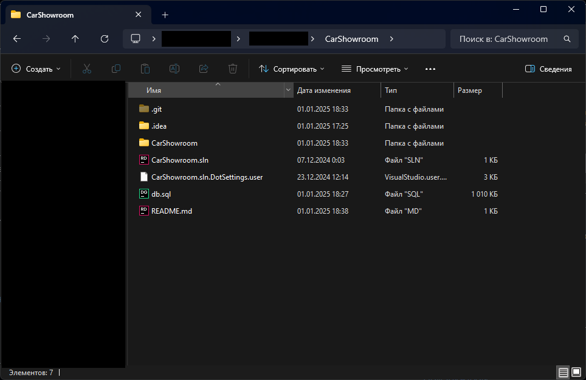
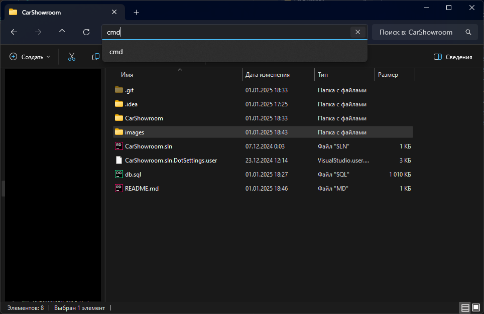
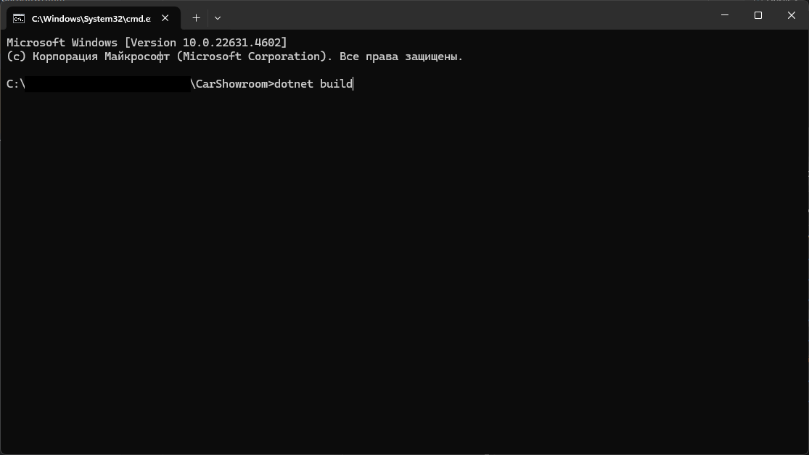

## Настройка приложения

___

### Восстановление пакетов

После распаковки программы необходимо восстановить пакеты.

1. Переходим в папку проекта, там где лежит файл <span style="color:#b4de1d">CarShowroom.sln</span>
   
2. В строке поиска вводим cmd
   
3. В CMD вводим команду <span style="color:green">dotnet build</span> и нажимаем enter
   

Если консоль не выведет ошибок, значит, все хорошо.
___

### Подключение базы

1. В папке проекта лежит файл <span style="color:#b4de1d">db.sql</span>.
   Его нужно открыть в SSMS и выполнить полностью.
2. В проекте нужно перейти по пути <span style="color:#b4de1d">Database/CarShowroomDbContext</span> и найти 50 строку. 
   ```csharp
   protected override void OnConfiguring(DbContextOptionsBuilder optionsBuilder)
   #warning To protect potentially sensitive information in your connection string, you should move it out of source code. You can avoid scaffolding the connection string by using the Name= syntax to read it from configuration - see https://go.microsoft.com/fwlink/?linkid=2131148. For more guidance on storing connection strings, see https://go.microsoft.com/fwlink/?LinkId=723263.
        => optionsBuilder.UseSqlServer("Server=LEGION;Database=CarShowroomDb;Trusted_connection=True;TrustServerCertificate=True");
   ```
3. Вместо LEGION нужно ввести название своего сервера.